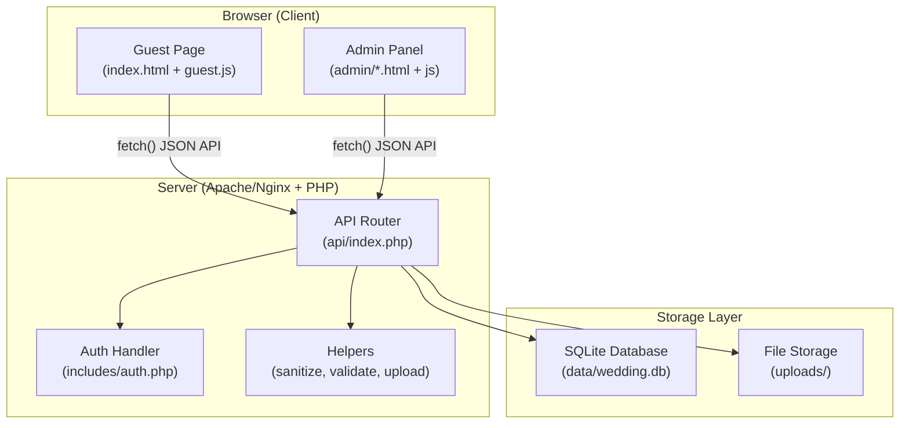
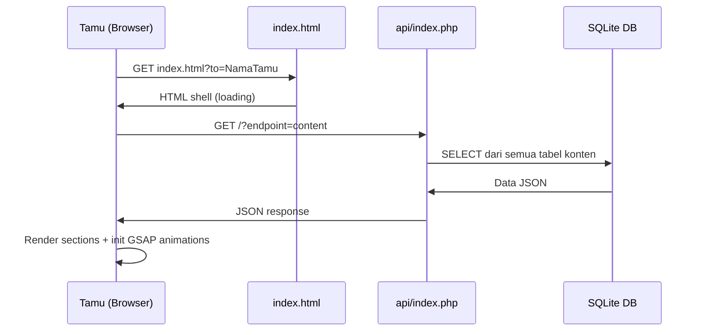

# Desain Teknis — Website Undangan Digital Pernikahan

## Overview

Website undangan digital pernikahan ini terdiri dari dua komponen utama: **Guest Page** (halaman tamu) dan **Admin Panel** (panel pengelolaan konten). Sistem dibangun dengan prinsip kesederhanaan dan fungsionalitas — satu folder project, database SQLite (file tunggal), dan di-deploy ke VPS.

**Stack Teknologi:**
- **Frontend**: HTML5, CSS3, Vanilla JavaScript (ES6+)
- **Animasi**: GSAP (GreenSock) + ScrollTrigger plugin
- **Partikel**: tsParticles (library ringan berbasis canvas)
- **Backend**: PHP 7.4+ dengan file-based routing (tanpa framework)
- **Database**: SQLite via PHP PDO (file `data/wedding.db`)
- **File Storage**: Folder `uploads/` di server
- **Font**: Google Fonts — Playfair Display (serif) + Inter (sans-serif)
- **Icons**: Feather Icons (SVG inline)
- **Deploy**: VPS dengan Apache/Nginx + PHP

---

## Architecture

### Diagram Arsitektur



### Request Flow



### Struktur Folder Project

```
wedding-invitation/
├── index.html                 # Entry point Guest Page
├── admin/
│   ├── login.html             # Halaman login
│   ├── index.html             # Dashboard admin
│   ├── couple.html            # Kelola data mempelai
│   ├── events.html            # Kelola detail acara
│   ├── gallery.html           # Kelola foto galeri
│   ├── love-story.html        # Kelola love story
│   ├── envelope.html          # Kelola amplop digital
│   ├── rsvp.html              # Lihat & kelola RSVP
│   ├── guestbook.html         # Lihat & kelola buku tamu
│   └── music.html             # Upload musik latar
├── api/
│   ├── index.php              # Router API (file-based routing)
│   ├── auth.php               # Endpoint autentikasi
│   ├── content.php            # Endpoint konten publik
│   ├── gallery.php            # Endpoint galeri
│   ├── love-story.php         # Endpoint love story
│   ├── envelope.php           # Endpoint amplop digital
│   ├── rsvp.php               # Endpoint RSVP
│   ├── guestbook.php          # Endpoint buku tamu
│   └── music.php              # Endpoint musik
├── assets/
│   ├── css/
│   │   ├── guest.css          # Styles Guest Page
│   │   ├── admin.css          # Styles Admin Panel
│   │   └── animations.css     # CSS keyframes
│   ├── js/
│   │   ├── guest.js           # Logika utama Guest Page
│   │   ├── particles.js       # Konfigurasi tsParticles
│   │   ├── countdown.js       # Countdown timer logic
│   │   ├── rsvp.js            # RSVP form logic
│   │   ├── guestbook.js       # Guestbook form logic
│   │   ├── lightbox.js        # Galeri lightbox
│   │   ├── music.js           # Background music controller
│   │   └── admin.js           # Logika Admin Panel
│   └── images/
│       └── ornaments/         # SVG batik/floral ornamen
├── uploads/
│   ├── couple/                # Foto profil mempelai
│   ├── gallery/               # Foto galeri
│   ├── love-story/            # Foto item love story
│   └── music/                 # File musik latar
├── data/
│   └── wedding.db             # Database SQLite
├── includes/
│   ├── db.php                 # Koneksi database PDO
│   ├── auth.php               # Helper autentikasi & session
│   ├── helpers.php            # Fungsi utilitas
│   ├── upload.php             # Helper upload file
│   └── config.php             # Konfigurasi global
└── .htaccess                  # Rewrite rules & proteksi folder
```

---

## Components and Interfaces

### Komponen Guest Page

Halaman tamu terdiri dari 12 section yang dirender berurutan:

| # | Section | Komponen JS | Kondisi Tampil |
|---|---------|-------------|----------------|
| 1 | Cover + Opening Animation | `animations.js` | Selalu |
| 2 | Bismillah / Pembuka | `animations.js` | Selalu |
| 3 | Profil Mempelai | `animations.js` | Selalu |
| 4 | Detail Acara | `animations.js` | Selalu |
| 5 | Countdown Timer | `countdown.js` | Jika tanggal diisi |
| 6 | Galeri Foto | `lightbox.js` | Jika ada foto |
| 7 | Love Story / Timeline | `animations.js` | Jika ada item |
| 8 | Peta Lokasi | — | Jika URL Maps diisi |
| 9 | RSVP Form | `rsvp.js` | Selalu |
| 10 | Buku Tamu | `guestbook.js` | Selalu |
| 11 | Amplop Digital | — | Jika ada entri |
| 12 | Footer + Share | — | Selalu |

### Komponen Admin Panel

| Modul | File | Deskripsi |
|-------|------|-----------|
| Login | `admin/login.php` | Form login dengan rate limiting |
| Dashboard | `admin/index.php` | Statistik snapshot |
| Data Mempelai | `admin/couple.php` | Edit profil + upload foto |
| Detail Acara | `admin/events.php` | Edit akad & resepsi |
| Galeri | `admin/gallery.php` | Upload/hapus foto |
| Love Story | `admin/love-story.php` | CRUD item timeline |
| Amplop Digital | `admin/envelope.php` | CRUD rekening |
| RSVP | `admin/rsvp.php` | Lihat & ekspor CSV |
| Buku Tamu | `admin/guestbook.php` | Lihat & hapus ucapan |
| Musik | `admin/music.php` | Upload file musik |

### Interface API (JSON)

Semua endpoint menggunakan response format seragam:

```json
{ "success": true, "data": { ... }, "message": "Opsional" }
```

Error format:
```json
{ "success": false, "error": "Deskripsi error", "code": 400 }
```

#### Daftar Endpoint API

**Publik (tanpa auth):**

| Method | Endpoint | Deskripsi |
|--------|----------|-----------|
| GET | `/api/?endpoint=content` | Ambil semua konten undangan |
| GET | `/api/?endpoint=guestbook` | Ambil daftar ucapan |
| POST | `/api/?endpoint=rsvp` | Kirim RSVP |
| POST | `/api/?endpoint=guestbook` | Kirim ucapan |
| POST | `/api/?endpoint=auth&action=login` | Login admin |

**Admin (perlu autentikasi):**

| Method | Endpoint | Deskripsi |
|--------|----------|-----------|
| GET | `/api/?endpoint=dashboard` | Statistik snapshot |
| PUT | `/api/?endpoint=couple&role=groom` | Update data mempelai |
| POST | `/api/?endpoint=couple&role=groom&action=photo` | Upload foto mempelai |
| PUT | `/api/?endpoint=events&type=akad` | Update detail acara |
| PUT | `/api/?endpoint=settings` | Update pengaturan umum |
| POST | `/api/?endpoint=gallery` | Upload foto galeri |
| DELETE | `/api/?endpoint=gallery&id={id}` | Hapus foto galeri |
| POST | `/api/?endpoint=love-story` | Tambah item love story |
| PUT | `/api/?endpoint=love-story&id={id}` | Edit item love story |
| DELETE | `/api/?endpoint=love-story&id={id}` | Hapus item love story |
| POST | `/api/?endpoint=envelope` | Tambah entri amplop |
| PUT | `/api/?endpoint=envelope&id={id}` | Edit entri amplop |
| DELETE | `/api/?endpoint=envelope&id={id}` | Hapus entri amplop |
| GET | `/api/?endpoint=rsvp` | Daftar RSVP |
| GET | `/api/?endpoint=rsvp&action=export` | Ekspor CSV |
| DELETE | `/api/?endpoint=rsvp&id={id}` | Hapus entri RSVP |
| DELETE | `/api/?endpoint=guestbook&id={id}` | Hapus ucapan |
| POST | `/api/?endpoint=music` | Upload file musik |
| DELETE | `/api/?endpoint=music&id={id}` | Hapus file musik |
| POST | `/api/?endpoint=auth&action=logout` | Logout admin |

### Layout Visual Utama

**Cover Section:**
```
┌─────────────────────────────────┐
│  [ornamen batik kiri]           │
│   "Kepada Yth."                 │
│   [NamaTamu]                    │
│   ── ✦ ──                       │
│   THE WEDDING OF                │
│   Ahmad & Siti                  │
│   15 · Agustus · 2025           │
│   [ Buka Undangan ]             │
│  [ornamen batik kanan]          │
└─────────────────────────────────┘
```

**Detail Acara:**
```
┌─────────────────┐   ┌─────────────────┐
│    A K A D      │   │  R E S E P S I  │
│  15 Agustus '25 │   │  15 Agustus '25 │
│  09.00 - 11.00  │   │  12.00 - 17.00  │
│  Masjid Al-...  │   │  Gedung ...     │
│  [+ Kalender]   │   │  [+ Kalender]   │
└─────────────────┘   └─────────────────┘
```

**Admin Layout:**
```
┌─────────────────────────────────────────────────────────┐
│  HEADER: Logo | "Wedding Admin" | [Pratinjau] [Logout]  │
├──────────────┬──────────────────────────────────────────┤
│  SIDEBAR     │   CONTENT AREA                           │
│  Dashboard   │   (Konten modul yang dipilih)            │
│  Mempelai    │                                          │
│  Acara       │                                          │
│  ...         │                                          │
└──────────────┴──────────────────────────────────────────┘
```

### Sistem Animasi (GSAP)

```javascript
// Inisialisasi GSAP
gsap.registerPlugin(ScrollTrigger);

// Opening animation timeline (~4 detik)
function playOpeningAnimation(onComplete) {
    const tl = gsap.timeline({ onComplete });
    tl
        .fromTo('.envelope', { y: 100, opacity: 0 }, { y: 0, opacity: 1, duration: 0.6 })
        .to('.envelope-lid', { rotateX: -160, duration: 0.8 }, "+=0.2")
        .to('.invitation-card', { y: -80, opacity: 1, duration: 0.6 }, "-=0.3")
        .to('.flower-petals', { scale: 1, opacity: 1, stagger: 0.1, duration: 0.5 }, "-=0.2")
        .to('.cover-content', { opacity: 1, y: 0, duration: 0.5 }, "-=0.1");
    return tl;
}

// ScrollTrigger per section
function initScrollAnimations() {
    document.querySelectorAll('[data-animate]').forEach(el => {
        gsap.fromTo(el, { opacity: 0, y: 30 }, {
            opacity: 1, y: 0,
            duration: 0.5,
            scrollTrigger: { trigger: el, start: "top 80%", once: true }
        });
    });
}
```

### Desain Visual — Palet Warna (Modern Heritage)

| Nama | Hex | Penggunaan |
|------|-----|------------|
| Hijau Tua | `#2D5016` | Heading, tombol utama |
| Hijau Medium | `#4A7C59` | Aksen, border |
| Sage Green | `#87A878` | Background section alt |
| Hijau Muda | `#C8DDB0` | Hover state |
| Cream | `#FAF7F0` | Background utama |
| Putih | `#FFFFFF` | Kartu, modal |
| Emas | `#C9A84C` | Ornamen, divider |
| Coklat Tua | `#2C1A0E` | Body text |

### Tipografi

```css
--font-serif: 'Playfair Display', Georgia, serif;  /* Heritage, heading */
--font-sans:  'Inter', system-ui, sans-serif;       /* Modern, body/UI */
```

Breakpoint responsif: mobile `< 768px` (1 kolom), tablet `768px–1023px` (2 kolom), desktop `≥ 1024px` (3 kolom + sidebar).

---

## Data Models

### Diagram Entity-Relationship

```mermaid
erDiagram
    SETTINGS {
        integer id PK
        text key UK
        text value
        text updated_at
    }
    COUPLE {
        integer id PK
        text role "groom|bride"
        text full_name
        text nickname
        text father_name
        text mother_name
        text photo_path
        text updated_at
    }
    EVENTS {
        integer id PK
        text type "akad|resepsi"
        text event_date
        text start_time
        text end_time
        text venue_name
        text address
        text maps_url
        text maps_embed_url
        text updated_at
    }
    GALLERY {
        integer id PK
        text file_path
        text caption
        integer sort_order
        text created_at
    }
    LOVE_STORY {
        integer id PK
        text title
        text story_date
        text description
        text photo_path
        integer sort_order
        text created_at
    }
    DIGITAL_ENVELOPE {
        integer id PK
        text bank_name
        text account_holder
        text account_number
        integer sort_order
        text created_at
    }
    RSVP {
        integer id PK
        text guest_name
        text phone
        text attendance "hadir|tidak_hadir"
        integer guest_count
        text submitted_at
        text updated_at
    }
    GUESTBOOK {
        integer id PK
        text sender_name
        text message
        text submitted_at
    }
    ADMIN_USERS {
        integer id PK
        text username UK
        text password_hash
        integer failed_attempts
        text locked_until
        text last_login
        text created_at
    }
    MUSIC {
        integer id PK
        text file_path
        text original_name
        integer is_active
        text uploaded_at
    }
```



### DDL SQL Lengkap

```sql
CREATE TABLE IF NOT EXISTS settings (
    id         INTEGER PRIMARY KEY AUTOINCREMENT,
    key        TEXT NOT NULL UNIQUE,
    value      TEXT,
    updated_at TEXT DEFAULT (datetime('now','localtime'))
);

INSERT OR IGNORE INTO settings (key, value) VALUES
    ('opening_text', 'Bismillahirrahmanirrahim'),
    ('couple_hashtag', '#WeddingDay'),
    ('website_title', 'Wedding Invitation');

CREATE TABLE IF NOT EXISTS couple (
    id          INTEGER PRIMARY KEY AUTOINCREMENT,
    role        TEXT NOT NULL CHECK(role IN ('groom','bride')),
    full_name   TEXT NOT NULL DEFAULT '',
    nickname    TEXT NOT NULL DEFAULT '',
    father_name TEXT NOT NULL DEFAULT '',
    mother_name TEXT NOT NULL DEFAULT '',
    photo_path  TEXT,
    updated_at  TEXT DEFAULT (datetime('now','localtime'))
);
INSERT OR IGNORE INTO couple (role) VALUES ('groom'), ('bride');

CREATE TABLE IF NOT EXISTS events (
    id             INTEGER PRIMARY KEY AUTOINCREMENT,
    type           TEXT NOT NULL CHECK(type IN ('akad','resepsi')),
    event_date     TEXT,
    start_time     TEXT,
    end_time       TEXT,
    venue_name     TEXT DEFAULT '',
    address        TEXT DEFAULT '',
    maps_url       TEXT DEFAULT '',
    maps_embed_url TEXT DEFAULT '',
    updated_at     TEXT DEFAULT (datetime('now','localtime'))
);
INSERT OR IGNORE INTO events (type) VALUES ('akad'), ('resepsi');

CREATE TABLE IF NOT EXISTS gallery (
    id         INTEGER PRIMARY KEY AUTOINCREMENT,
    file_path  TEXT NOT NULL,
    caption    TEXT DEFAULT '',
    sort_order INTEGER DEFAULT 0,
    created_at TEXT DEFAULT (datetime('now','localtime'))
);

CREATE TABLE IF NOT EXISTS love_story (
    id          INTEGER PRIMARY KEY AUTOINCREMENT,
    title       TEXT NOT NULL,
    story_date  TEXT NOT NULL,
    description TEXT DEFAULT '',
    photo_path  TEXT,
    sort_order  INTEGER DEFAULT 0,
    created_at  TEXT DEFAULT (datetime('now','localtime'))
);

CREATE TABLE IF NOT EXISTS digital_envelope (
    id             INTEGER PRIMARY KEY AUTOINCREMENT,
    bank_name      TEXT NOT NULL,
    account_holder TEXT NOT NULL,
    account_number TEXT NOT NULL,
    sort_order     INTEGER DEFAULT 0,
    created_at     TEXT DEFAULT (datetime('now','localtime'))
);

CREATE TABLE IF NOT EXISTS rsvp (
    id           INTEGER PRIMARY KEY AUTOINCREMENT,
    guest_name   TEXT NOT NULL,
    phone        TEXT DEFAULT '',
    attendance   TEXT NOT NULL CHECK(attendance IN ('hadir','tidak_hadir')),
    guest_count  INTEGER DEFAULT 1 CHECK(guest_count BETWEEN 1 AND 10),
    submitted_at TEXT DEFAULT (datetime('now','localtime')),
    updated_at   TEXT DEFAULT (datetime('now','localtime'))
);

CREATE TABLE IF NOT EXISTS guestbook (
    id           INTEGER PRIMARY KEY AUTOINCREMENT,
    sender_name  TEXT NOT NULL,
    message      TEXT NOT NULL,
    submitted_at TEXT DEFAULT (datetime('now','localtime'))
);

CREATE TABLE IF NOT EXISTS admin_users (
    id              INTEGER PRIMARY KEY AUTOINCREMENT,
    username        TEXT NOT NULL UNIQUE,
    password_hash   TEXT NOT NULL,
    failed_attempts INTEGER DEFAULT 0,
    locked_until    TEXT,
    last_login      TEXT,
    created_at      TEXT DEFAULT (datetime('now','localtime'))
);

CREATE TABLE IF NOT EXISTS music (
    id            INTEGER PRIMARY KEY AUTOINCREMENT,
    file_path     TEXT NOT NULL,
    original_name TEXT NOT NULL,
    is_active     INTEGER DEFAULT 1,
    uploaded_at   TEXT DEFAULT (datetime('now','localtime'))
);

-- Index untuk performa query
CREATE INDEX IF NOT EXISTS idx_rsvp_guest_name  ON rsvp(guest_name COLLATE NOCASE);
CREATE INDEX IF NOT EXISTS idx_guestbook_time   ON guestbook(submitted_at DESC);
CREATE INDEX IF NOT EXISTS idx_gallery_sort     ON gallery(sort_order);
CREATE INDEX IF NOT EXISTS idx_love_story_date  ON love_story(story_date ASC);
```

### Batasan dan Aturan Domain

| Field | Tipe | Batas | Validasi |
|-------|------|-------|---------|
| `couple.full_name` | TEXT | 100 char | NOT NULL |
| `couple.nickname` | TEXT | 50 char | NOT NULL |
| `couple.father_name` | TEXT | 100 char | NOT NULL |
| `events.venue_name` | TEXT | 200 char | — |
| `events.address` | TEXT | 500 char | — |
| `events.end_time` | TEXT | — | ≥ start_time |
| `rsvp.guest_name` | TEXT | 100 char | NOT NULL, trim |
| `rsvp.attendance` | ENUM | — | 'hadir'\|'tidak_hadir' |
| `rsvp.guest_count` | INT | 1–10 | CHECK constraint |
| `guestbook.sender_name` | TEXT | 100 char | NOT NULL |
| `guestbook.message` | TEXT | 500 char | NOT NULL |
| `settings.opening_text` | TEXT | 500 char | — |

---

## Correctness Properties

*A property is a characteristic or behavior that should hold true across all valid executions of a system — essentially, a formal statement about what the system should do. Properties serve as the bridge between human-readable specifications and machine-verifiable correctness guarantees.*

Fitur ini melibatkan sejumlah fungsi murni (pure functions) seperti validasi input, transformasi data, kalkulasi waktu, dan sanitasi teks yang sangat sesuai untuk property-based testing. Library yang digunakan: **fast-check** (JavaScript) untuk fungsi frontend, dan **Eris** (PHP) untuk fungsi backend.

---

### Property 1: Personalisasi Nama Tamu

*Untuk sembarang* string nama tamu yang tidak kosong, fungsi `buildGreeting(name)` harus menghasilkan string yang mengandung nama tersebut secara verbatim dalam output salam.

**Validates: Requirements 1.3**

---

### Property 2: Konsistensi Validasi Panjang Teks

*Untuk sembarang* string teks dan batas panjang maksimum positif, fungsi `validateTextLength(text, maxLength)` harus mengembalikan `false` jika dan hanya jika panjang teks melebihi batas maksimum, dan `true` jika panjang teks berada dalam batas.

**Validates: Requirements 2.3, 3.3, 7.3, 10.2, 17.1, 17.2, 17.3**

---

### Property 3: Kelengkapan Data pada File .ics

*Untuk sembarang* objek data acara yang valid (berisi judul, tanggal, waktu mulai, waktu selesai, dan alamat), fungsi `generateICS(event)` harus menghasilkan string yang mengandung semua lima field tersebut dalam format iCalendar yang dapat diparse.

**Validates: Requirements 4.3**

---

### Property 4: Validasi Konsistensi Rentang Waktu

*Untuk sembarang* pasangan waktu (waktu_mulai, waktu_selesai), fungsi `validateTimeRange(start, end)` harus mengembalikan `false` jika waktu_selesai lebih awal dari waktu_mulai, dan `true` jika waktu_selesai sama dengan atau lebih lambat dari waktu_mulai.

**Validates: Requirements 4.5**

---

### Property 5: Countdown Timer Non-Negatif dan Konsisten

*Untuk sembarang* tanggal target di masa depan, fungsi `calculateCountdown(targetDate)` harus mengembalikan objek `{ days, hours, minutes, seconds }` di mana semua nilai non-negatif, `hours` selalu 0–23, `minutes` selalu 0–59, `seconds` selalu 0–59, dan total detik yang dikembalikan konsisten dengan selisih waktu sebenarnya antara `now` dan `targetDate`.

**Validates: Requirements 5.1, 5.2**

---

### Property 6: Validasi File Upload Konsisten

*Untuk sembarang* ukuran file dan tipe MIME, fungsi `validateFileUpload(fileSize, mimeType, allowedTypes, maxSizeBytes)` harus mengembalikan `false` jika `fileSize > maxSizeBytes` atau jika `mimeType` tidak termasuk dalam `allowedTypes`, dan `true` hanya jika kedua kondisi valid terpenuhi.

**Validates: Requirements 6.6, 7.4, 13.5**

---

### Property 7: Validasi RSVP Komprehensif

*Untuk sembarang* objek data RSVP, fungsi `validateRSVP(data)` harus mengembalikan `false` jika salah satu kondisi ini terpenuhi: `guest_name` kosong/hanya whitespace, `attendance` bukan `'hadir'` atau `'tidak_hadir'`, atau `guest_count` di luar rentang 1–10. Fungsi harus mengembalikan `true` hanya jika semua kondisi valid.

**Validates: Requirements 9.3, 9.4, 19.6**

---

### Property 8: Idempoten Pengiriman RSVP

*Untuk sembarang* nama tamu dan variasi penulisan case-nya, setelah dua atau lebih pengiriman RSVP dengan nama yang secara case-insensitive identik, jumlah total entri RSVP dalam database untuk nama tersebut harus tepat satu (data terbaru menimpa data sebelumnya — upsert).

**Validates: Requirements 9.6**

---

### Property 9: Validasi Buku Tamu Komprehensif

*Untuk sembarang* objek data ucapan, fungsi `validateGuestbook(data)` harus mengembalikan `false` jika `sender_name` kosong/hanya whitespace, `message` kosong/hanya whitespace, atau panjang `message` melebihi 500 karakter. Fungsi harus mengembalikan `true` hanya jika semua kondisi valid.

**Validates: Requirements 10.2, 10.3**

---

### Property 10: Strip Parameter ?to= dari URL Share

*Untuk sembarang* URL undangan yang mengandung parameter `?to=NamaTamu` (dalam berbagai posisi di query string), fungsi `stripToParam(url)` harus mengembalikan URL yang tidak mengandung parameter `to` sama sekali, sambil mempertahankan semua parameter query lainnya.

**Validates: Requirements 12.3**

---

### Property 11: Sanitasi Input Menghilangkan Konten Berbahaya

*Untuk sembarang* string input yang mengandung tag HTML atau karakter berbahaya lainnya, fungsi `sanitizeText(input, maxLength)` harus mengembalikan string yang tidak mengandung tag HTML yang dapat dieksekusi, tidak melebihi `maxLength` karakter, dan tidak mengubah konten normal yang tidak berbahaya.

**Validates: Requirements 19.2, 19.3**

---

## Error Handling

### Strategi Dua Lapis

Sistem menggunakan validasi client-side (JavaScript) sebagai UX layer, dan validasi server-side (PHP) sebagai lapisan definitif. Server tidak pernah mempercayai data dari client.

### Error Handling Guest Page

| Kondisi | Perilaku |
|---------|---------|
| API content gagal dimuat | Tampilkan konten fallback dari localStorage atau skeleton UI |
| Foto mempelai tidak ditemukan | Tampilkan gambar placeholder SVG inline |
| Google Maps gagal dimuat | Tampilkan alamat teks lengkap sebagai pengganti |
| Countdown tanpa tanggal | Sembunyikan section (`display: none`) |
| Peta tanpa URL Maps | Sembunyikan section |
| Amplop tanpa entri | Sembunyikan section |
| Musik belum diupload | Tombol musik `disabled`, tidak ada error |
| Clipboard API gagal | Tampilkan "Salin manual: [nomor]" |
| RSVP submission gagal | Pesan error inline, tidak ada data parsial tersimpan |
| Guestbook submission gagal | Pesan error inline, form tidak direset |

### Error Handling Admin Panel

| Kondisi | Perilaku |
|---------|---------|
| File upload > limit | Error spesifik, tolak file |
| File format tidak valid | Error spesifik, tolak file |
| Simpan data gagal (DB error) | Pesan error deskriptif, data sebelumnya dipertahankan |
| Validasi field gagal | Highlight merah per field, pesan validasi spesifik |
| Session expired | Redirect ke halaman login |
| Login gagal | Pesan error umum, increment counter gagal |
| Login terkunci | Tampilkan sisa waktu lockout, tolak semua request |

### Format Error Response API

```php
function sendError(int $code, string $message): void {
    http_response_code($code);
    header('Content-Type: application/json');
    echo json_encode(['success' => false, 'error' => $message, 'code' => $code]);
    exit;
}
```

### Validasi dan Sanitasi Input

```php
// Semua input teks diproses melalui sanitizeText sebelum disimpan
function sanitizeText(string $input, int $maxLength): string {
    $clean = strip_tags(trim($input));
    $clean = htmlspecialchars($clean, ENT_QUOTES, 'UTF-8');
    return mb_substr($clean, 0, $maxLength);
}

// Validasi enum attendance RSVP
function validateAttendance(string $value): bool {
    return in_array($value, ['hadir', 'tidak_hadir'], true);
}

// Validasi rentang waktu acara
function validateTimeRange(string $start, string $end): bool {
    return strtotime($end) >= strtotime($start);
}
```

### Proteksi File Upload

```php
const ALLOWED_IMAGE_TYPES = ['image/jpeg', 'image/png', 'image/webp'];
const ALLOWED_AUDIO_TYPES = ['audio/mpeg', 'audio/ogg'];
const MAX_IMAGE_SIZE = 5 * 1024 * 1024;   // 5 MB
const MAX_AUDIO_SIZE = 10 * 1024 * 1024;  // 10 MB

function validateAndSaveFile(array $file, string $subdir, array $allowedTypes, int $maxSize): string {
    if ($file['size'] > $maxSize) throw new RuntimeException('Ukuran file melebihi batas.');
    $finfo    = new finfo(FILEINFO_MIME_TYPE);
    $mimeType = $finfo->file($file['tmp_name']);
    if (!in_array($mimeType, $allowedTypes, true)) {
        throw new RuntimeException('Format file tidak didukung.');
    }
    $ext      = match($mimeType) {
        'image/jpeg' => 'jpg', 'image/png' => 'png', 'image/webp' => 'webp',
        'audio/mpeg' => 'mp3', 'audio/ogg' => 'ogg',
    };
    $filename = bin2hex(random_bytes(16)) . '.' . $ext;
    $destPath = "uploads/{$subdir}/{$filename}";
    if (!move_uploaded_file($file['tmp_name'], $destPath)) {
        throw new RuntimeException('Gagal menyimpan file.');
    }
    return $destPath;
}
```

---

## Testing Strategy

### Pendekatan Dual Testing

Sistem menggunakan dua pendekatan yang saling melengkapi:
- **Unit Tests**: Menguji contoh spesifik, kasus edge, dan kondisi error
- **Property-Based Tests (PBT)**: Menguji properti universal dengan input yang di-generate secara acak (min. 100 iterasi)

### Library Testing

- **JavaScript**: [Vitest](https://vitest.dev/) + [fast-check](https://github.com/dubzzz/fast-check) (`@fast-check/vitest`)
- **PHP**: [PHPUnit](https://phpunit.de/) + [Eris](https://github.com/giorgiosironi/eris) untuk PBT

### Konfigurasi Property-Based Testing

```javascript
// vitest.config.js
import { configureGlobal } from "@fast-check/vitest";

configureGlobal({ numRuns: 100, verbose: true });
```

### Contoh Implementasi Property Tests

```javascript
// Feature: digital-wedding-invitation, Property 1: Personalisasi nama tamu
import { it, fc } from "@fast-check/vitest";
import { buildGreeting } from "../src/guest.js";

it.prop([fc.string({ minLength: 1 })])(
    "Feature: digital-wedding-invitation, Property 1: buildGreeting mengandung nama tamu",
    (name) => {
        const greeting = buildGreeting(name);
        expect(greeting).toContain(name);
    }
);
```

```javascript
// Feature: digital-wedding-invitation, Property 5: Countdown non-negatif
import { it, fc } from "@fast-check/vitest";
import { calculateCountdown } from "../src/countdown.js";

it.prop([fc.date({ min: new Date(Date.now() + 60000) })])(
    "Feature: digital-wedding-invitation, Property 5: countdown timer non-negatif",
    (futureDate) => {
        const r = calculateCountdown(futureDate);
        expect(r.days).toBeGreaterThanOrEqual(0);
        expect(r.hours).toBeGreaterThanOrEqual(0);
        expect(r.hours).toBeLessThanOrEqual(23);
        expect(r.minutes).toBeGreaterThanOrEqual(0);
        expect(r.minutes).toBeLessThanOrEqual(59);
        expect(r.seconds).toBeGreaterThanOrEqual(0);
        expect(r.seconds).toBeLessThanOrEqual(59);
    }
);
```

```javascript
// Feature: digital-wedding-invitation, Property 7: Validasi RSVP komprehensif
it.prop([fc.record({
    guest_name: fc.oneof(fc.constant(''), fc.string()),
    attendance: fc.oneof(fc.constant('hadir'), fc.constant('tidak_hadir'), fc.string()),
    guest_count: fc.integer({ min: -5, max: 15 })
})])(
    "Feature: digital-wedding-invitation, Property 7: validateRSVP konsisten dengan aturan",
    (data) => {
        const isValid =
            data.guest_name.trim().length > 0 &&
            ['hadir', 'tidak_hadir'].includes(data.attendance) &&
            data.guest_count >= 1 && data.guest_count <= 10;
        expect(validateRSVP(data)).toBe(isValid);
    }
);
```

```javascript
// Feature: digital-wedding-invitation, Property 8: Idempoten RSVP upsert
it.prop([fc.string({ minLength: 1 }), fc.constantFrom('hadir', 'tidak_hadir')])(
    "Feature: digital-wedding-invitation, Property 8: double submit RSVP menghasilkan satu entri",
    async (guestName, attendance) => {
        const db = createInMemoryDb();
        await submitRSVP(db, { guest_name: guestName, attendance, guest_count: 1 });
        await submitRSVP(db, { guest_name: guestName.toUpperCase(), attendance, guest_count: 2 });
        const entries = await db.query(
            'SELECT * FROM rsvp WHERE LOWER(guest_name) = LOWER(?)', [guestName]
        );
        expect(entries.length).toBe(1);
    }
);
```

```javascript
// Feature: digital-wedding-invitation, Property 11: Sanitasi input berbahaya
it.prop([fc.oneof(
    fc.string().map(s => `<script>${s}</script>`),
    fc.string().map(s => `'; DROP TABLE rsvp; --${s}`),
    fc.string()
)])(
    "Feature: digital-wedding-invitation, Property 11: sanitizeText tidak menghasilkan tag eksekutable",
    (input) => {
        const result = sanitizeText(input, 500);
        expect(result).not.toMatch(/<script/i);
        expect(result).not.toMatch(/onerror\s*=/i);
        expect(result.length).toBeLessThanOrEqual(500);
    }
);
```

### Rencana Test Coverage

| Kategori | Framework | Jumlah |
|---------|-----------|--------|
| Unit — helper functions | Vitest | ~30 test |
| Unit — validasi form | Vitest | ~20 test |
| Unit — UI interactions | Vitest + JSDOM | ~15 test |
| PBT — Property 1–11 | fast-check | 11 × min 100 iterasi |
| Integration — API PHP | PHPUnit | ~25 test |
| Integration — DB operations | PHPUnit | ~20 test |
| E2E — alur utama | Playwright (manual) | ~10 skenario |

### Perintah Menjalankan Tests

```bash
# Unit + property tests JavaScript (mode single-run)
npx vitest --run

# PHPUnit tests
./vendor/bin/phpunit tests/

# Jalankan property tests dengan verbose output
npx vitest --run --reporter=verbose tests/properties/
```

### Unit Tests untuk Kasus Edge Penting

```javascript
describe('calculateCountdown — edge cases', () => {
    test('tanggal yang sudah lewat mengembalikan elapsed: true', () => {
        const pastDate = new Date(Date.now() - 86400000);
        expect(calculateCountdown(pastDate).elapsed).toBe(true);
    });
    test('tanggal null tidak menyebabkan error', () => {
        expect(() => calculateCountdown(null)).not.toThrow();
    });
});

describe('validateTimeRange — edge cases', () => {
    test('waktu sama dianggap valid', () => {
        expect(validateTimeRange('09:00', '09:00')).toBe(true);
    });
    test('waktu selesai lebih awal dari mulai dianggap invalid', () => {
        expect(validateTimeRange('09:00', '08:00')).toBe(false);
    });
});
```

---

*Dokumen ini akan diperbarui seiring perkembangan implementasi. Desain mengikuti prinsip YAGNI — hanya membangun yang dibutuhkan.*
